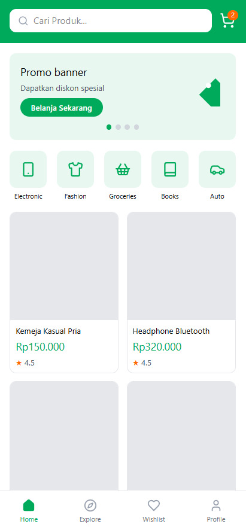
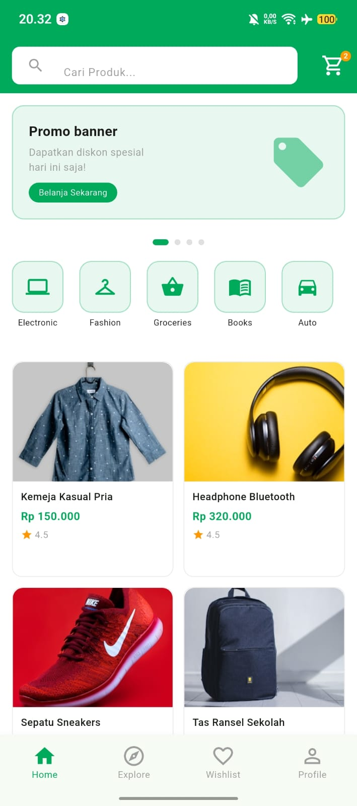

# Tugas UI Flutter — Replikasi Tokopedia

## Identitas
| | |
|---|---|
| **Nama** | [Nama Kamu] |
| **NIM** | [NIM Kamu] |
| **Kelas** | [Kelas Kamu] |
| **Pilihan** | C — Tokopedia/Shopee |

---

## Deskripsi Aplikasi
Aplikasi ini merupakan replikasi halaman beranda marketplace Tokopedia menggunakan Flutter. Menampilkan search bar, promo banner, kategori produk, dan grid 6 produk dengan gambar, nama, harga, dan rating.

---

## Halaman yang Dibuat
- **Halaman Beranda** — search bar, promo banner, kategori, grid produk (6 item), bottom navigation

---

## Struktur Folder
```
tugas_ui_flutter/
├── lib/
│   ├── main.dart
│   ├── pages/
│   │   └── home_page.dart
│   └── widgets/
│       ├── product_card.dart
│       ├── category_item.dart
│       └── promo_banner.dart
├── assets/
├── wireframe/
│   └── wireframe_foto.jpg
├── screenshot/
│   └── hasil_ui.png
├── pubspec.yaml
└── README.md
```

---

## Wireframe


---

## Screenshot Hasil


---

## Cara Menjalankan
```bash
flutter pub get
flutter run
```

---

## Teknologi
- Flutter 3.x
- Dart 3.x
- Material Design 3
